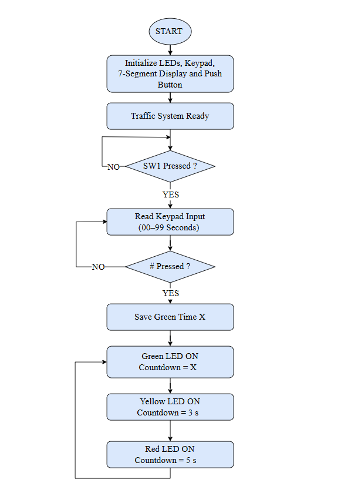

# Traffic Light Control System using Raspberry Pi Pico


---

## Overview

This project presents the design and implementation of a Traffic Light Control System using Raspberry Pi Pico W and CircuitPython. The system allows the user to enter a countdown value for the green traffic light using a 4×4 keypad. The countdown is displayed on a dual 7-segment display, while the yellow and red phases operate using fixed durations. After initialization, the traffic light sequence repeats continuously.

---

## Features

- User-defined green light countdown (00–99 seconds)
- Automatic traffic light sequence
- 4×4 keypad interface using MM74C922 encoder
- Dual 7-segment display using CD4511 BCD decoder
- Push button (SW1) to start the system
- Real-time countdown display
- Thonny Shell monitoring

---

## Hardware Components

- Raspberry Pi Pico W
- 4×4 Matrix Keypad
- MM74C922 Keypad Encoder
- Dual 7-Segment Display
- CD4511 BCD Decoder
- Green LED
- Yellow LED
- Red LED
- Push Button (SW1)
- Breadboard
- Jumper Wires

---

## GPIO Pin Configuration

| Component | GPIO Pin |
|-----------|----------|
| Green LED | GP26 |
| Yellow LED | GP27 |
| Red LED | GP28 |
| Push Button | GP15 |
| BCD A | GP5 |
| BCD B | GP4 |
| BCD C | GP3 |
| BCD D | GP2 |
| Ones Latch | GP6 |
| Tens Latch | GP7 |
| Data Available | GP14 |
| Keypad A | GP10 |
| Keypad B | GP11 |
| Keypad C | GP12 |
| Keypad D | GP13 |

---

## System Flowchart

<p align="center">
  
</p>

<p align="center">
<b>Figure 1.</b> Flowchart of the traffic light control system.
</p>

---

## Hardware Setup

<p align="center">
  
</p>

<p align="center">
<b>Figure 2.</b> Hardware setup of the traffic light control system.
</p>

---

## Green Phase

<p align="center">
  
</p>

<p align="center">
<b>Figure 3.</b> Green LED ON during the user-defined countdown.
</p>

---

## Yellow Phase

<p align="center">
  
</p>

<p align="center">
<b>Figure 4.</b> Yellow LED ON with a fixed 3-second countdown.
</p>

---

## Red Phase

<p align="center">
  
</p>

<p align="center">
<b>Figure 5.</b> Red LED ON with a fixed 5-second countdown.
</p>

---

## Thonny Shell Output

<p align="center">
  
</p>

<p align="center">
<b>Figure 6.</b> Program output displayed in the Thonny Shell.
</p>

---

## System Operation

1. Power on the Raspberry Pi Pico W.
2. Wait until the system is initialized.
3. Press the SW1 push button.
4. Enter a countdown value (00–99) using the keypad.
5. Press **#** to confirm the input.
6. The Green LED starts the user-defined countdown.
7. The Yellow LED remains ON for 3 seconds.
8. The Red LED remains ON for 5 seconds.
9. The sequence repeats continuously.

---

## Repository Structure

```text
Traffic-Light-Control-System/
│
├── README.md
├── code.py
├── LICENSE
├── .gitignore
├── LAB3_Report.pdf
├── flowchart.jpg
├── hardware_setup.jpg
├── green_phase.jpg
├── yellow_phase.jpg
├── red_phase.jpg
└── thonny_shell_output.jpg
```

---

## Source Code

The complete CircuitPython source code is provided in **code.py**.

If you would like to view the entire program directly in this page, copy the complete contents of **code.py** and paste it below.

```python
import board
import digitalio
import time

# =========================================================
# INITIALIZATION
# =========================================================

# Traffic LEDs
green_led = digitalio.DigitalInOut(board.GP26)
yellow_led = digitalio.DigitalInOut(board.GP27)
red_led = digitalio.DigitalInOut(board.GP28)

for led in [green_led, yellow_led, red_led]:
    led.direction = digitalio.Direction.OUTPUT
    led.value = False


# Push button (SW1)
sw1 = digitalio.DigitalInOut(board.GP15)
sw1.direction = digitalio.Direction.INPUT
sw1.pull = digitalio.Pull.UP


# ---------------------------------------------------------
# CD4511 (7-Segment BCD)
# A=GP5, B=GP4, C=GP3, D=GP2
# ---------------------------------------------------------
A = digitalio.DigitalInOut(board.GP5)
B = digitalio.DigitalInOut(board.GP4)
C = digitalio.DigitalInOut(board.GP3)
D = digitalio.DigitalInOut(board.GP2)

for pin in [A, B, C, D]:
    pin.direction = digitalio.Direction.OUTPUT

bcd_pins = [A, B, C, D]


# Latch pins
s72 = digitalio.DigitalInOut(board.GP7)   # Tens
s71 = digitalio.DigitalInOut(board.GP6)   # Ones

s72.direction = digitalio.Direction.OUTPUT
s71.direction = digitalio.Direction.OUTPUT


# ---------------------------------------------------------
# KEYPAD ENCODER (MM74C922)
# ---------------------------------------------------------
data_available = digitalio.DigitalInOut(board.GP14)
data_available.direction = digitalio.Direction.INPUT

data_pins = [board.GP10, board.GP11, board.GP12, board.GP13]

data_inputs = []
for pin in data_pins:
    dio = digitalio.DigitalInOut(pin)
    dio.direction = digitalio.Direction.INPUT
    data_inputs.append(dio)


# Mapping (correct)
keypad_map = {
    12: '1', 13: '2', 14: '3', 15: 'A',
    8: '4', 9: '5', 10: '6', 11: 'B',
    4: '7', 5: '8', 6: '9', 7: 'C',
    0: '*', 1: '0', 2: '#', 3: 'D'
}


# =========================================================
# FUNCTIONS
# =========================================================

def read_keypad():
    if data_available.value:
        value = 0
        for i, pin in enumerate(data_inputs):
            if pin.value:
                value |= (1 << i)   
        return keypad_map.get(value, '?')
    return None


def send_bcd(value):
    for i in range(4):
        bcd_pins[i].value = (value >> i) & 1


def latch(pin):
    pin.value = 0
    time.sleep(0.001)
    pin.value = 1


def display_number(num):
    tens = num // 10
    ones = num % 10

    send_bcd(tens)
    latch(s72)

    send_bcd(ones)
    latch(s71)


# ---------------------------------------------------------
# GET USER INPUT
# ---------------------------------------------------------
def get_user_input():
    value = ""

    print("Enter countdown (0-99), press # to start")

    while True:
        key = read_keypad()

        if key:
            print("Key Pressed:", key)

            if key.isdigit():
                if len(value) < 2:
                    value += key
                    print("Current Input:", value)

            elif key == "#":
                if value == "":
                    print("Error: No input")
                else:
                    return int(value)

            else:
                print("Ignored key")

            time.sleep(0.3)


# ---------------------------------------------------------
# COUNTDOWN FUNCTION
# ---------------------------------------------------------
def show_countdown(seconds, led, name):

    print(name, "PHASE START")

    # Turn OFF all LEDs first
    green_led.value = False
    yellow_led.value = False
    red_led.value = False

    led.value = True

    for i in range(seconds, -1, -1):
        print(name, "Time:", i)
        display_number(i)
        time.sleep(1)

    led.value = False


# =========================================================
# MAIN PROGRAM
# =========================================================

print("Traffic Light System Ready")

# Wait for SW1
while True:
    if not sw1.value:
        x = get_user_input()
        break


# Fixed durations
y = 3   # Yellow
z = 5   # Red


# Main loop
while True:
    show_countdown(x, green_led, "GREEN")
    show_countdown(y, yellow_led, "YELLOW")
    show_countdown(z, red_led, "RED")
```

---

## Report

The complete laboratory report is available in **LAB3_Report.pdf**.

---

## Software

- CircuitPython
- Thonny IDE
- Wokwi Simulator

---

## Author

**Adel Husham Mohamedain Yousuf**

---

## License

This project is licensed under the MIT License.
