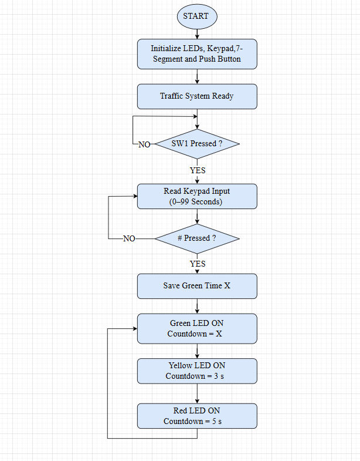
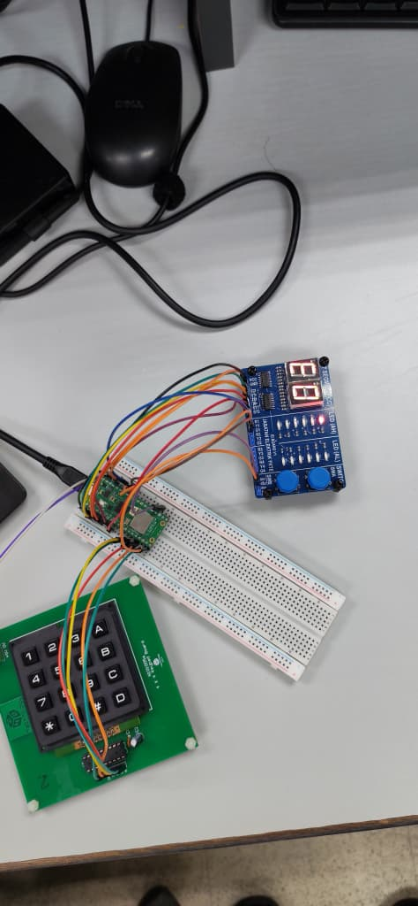
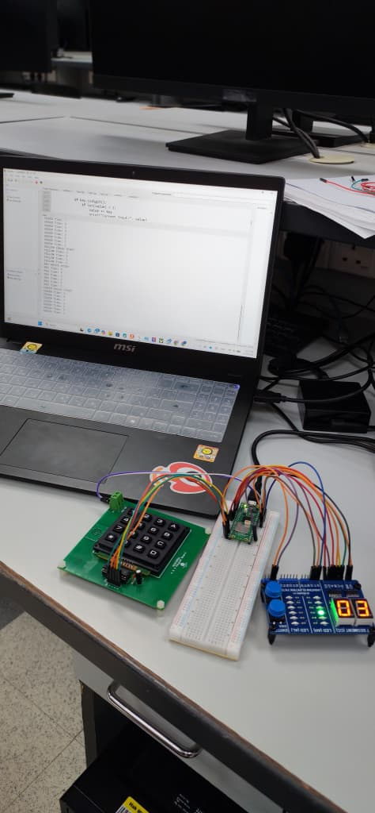
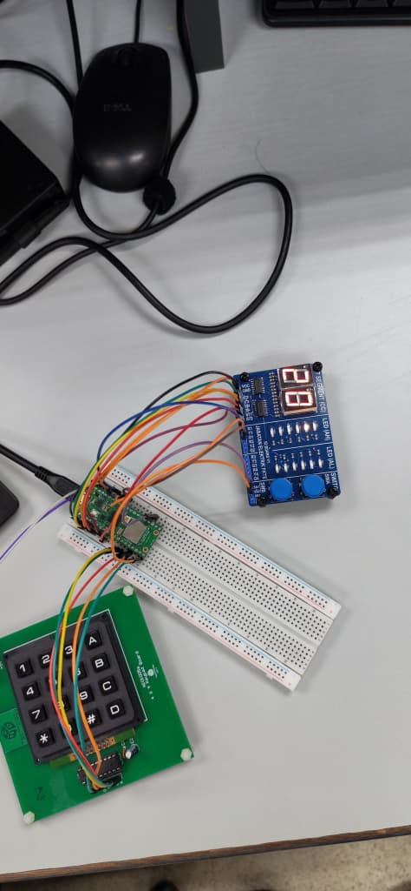
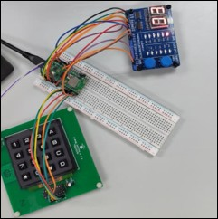
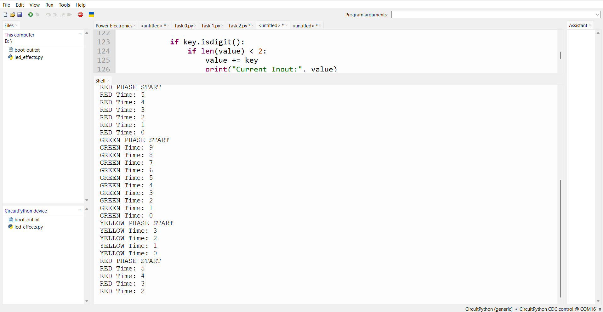

# Traffic Light Control System using Raspberry Pi Pico


## Overview

This project implements a traffic light control system using Raspberry Pi Pico and CircuitPython. The user enters the green light countdown using a keypad, and the countdown is displayed on a dual 7-segment display. The system then cycles through the green, yellow, and red traffic light phases automatically.

---

## Features

- User-defined green light countdown (00–99)
- 4×4 keypad input
- Dual 7-segment display
- Green, yellow, and red LEDs
- Push button to start the system
- Automatic traffic light sequence

---

## Hardware Components

- Raspberry Pi Pico
- 4×4 Keypad
- MM74C922 Keypad Encoder
- CD4511 BCD Decoder
- Dual 7-Segment Display
- Push Button
- Green LED
- Yellow LED
- Red LED
- Breadboard
- Jumper Wires

---

## Flowchart



**Figure 1.** Flowchart of the traffic light control system.

---

## Hardware Setup



**Figure 2.** Hardware setup.

---

## Green Phase



**Figure 3.** Green LED with user-defined countdown.

---

## Yellow Phase



**Figure 4.** Yellow LED with a fixed 3-second countdown.

---

## Red Phase



**Figure 5.** Red LED with a fixed 5-second countdown.

---

## Thonny Shell Output



**Figure 6.** Program output in Thonny IDE.

---

## Source Code

```python
import board
import digitalio
import time

# =========================================================
# INITIALIZATION
# =========================================================

# Traffic LEDs
green_led = digitalio.DigitalInOut(board.GP26)
yellow_led = digitalio.DigitalInOut(board.GP27)
red_led = digitalio.DigitalInOut(board.GP28)

for led in [green_led, yellow_led, red_led]:
    led.direction = digitalio.Direction.OUTPUT
    led.value = False


# Push button (SW1)
sw1 = digitalio.DigitalInOut(board.GP15)
sw1.direction = digitalio.Direction.INPUT
sw1.pull = digitalio.Pull.UP


# ---------------------------------------------------------
# CD4511 (7-Segment BCD)
# A=GP5, B=GP4, C=GP3, D=GP2
# ---------------------------------------------------------
A = digitalio.DigitalInOut(board.GP5)
B = digitalio.DigitalInOut(board.GP4)
C = digitalio.DigitalInOut(board.GP3)
D = digitalio.DigitalInOut(board.GP2)

for pin in [A, B, C, D]:
    pin.direction = digitalio.Direction.OUTPUT

bcd_pins = [A, B, C, D]


# Latch pins
s72 = digitalio.DigitalInOut(board.GP7)   # Tens
s71 = digitalio.DigitalInOut(board.GP6)   # Ones

s72.direction = digitalio.Direction.OUTPUT
s71.direction = digitalio.Direction.OUTPUT


# ---------------------------------------------------------
# KEYPAD ENCODER (MM74C922)
# ---------------------------------------------------------
data_available = digitalio.DigitalInOut(board.GP14)
data_available.direction = digitalio.Direction.INPUT

data_pins = [board.GP10, board.GP11, board.GP12, board.GP13]

data_inputs = []
for pin in data_pins:
    dio = digitalio.DigitalInOut(pin)
    dio.direction = digitalio.Direction.INPUT
    data_inputs.append(dio)


# Mapping (correct)
keypad_map = {
    12: '1', 13: '2', 14: '3', 15: 'A',
    8: '4', 9: '5', 10: '6', 11: 'B',
    4: '7', 5: '8', 6: '9', 7: 'C',
    0: '*', 1: '0', 2: '#', 3: 'D'
}


# =========================================================
# FUNCTIONS
# =========================================================

def read_keypad():
    if data_available.value:
        value = 0
        for i, pin in enumerate(data_inputs):
            if pin.value:
                value |= (1 << i)   
        return keypad_map.get(value, '?')
    return None


def send_bcd(value):
    for i in range(4):
        bcd_pins[i].value = (value >> i) & 1


def latch(pin):
    pin.value = 0
    time.sleep(0.001)
    pin.value = 1


def display_number(num):
    tens = num // 10
    ones = num % 10

    send_bcd(tens)
    latch(s72)

    send_bcd(ones)
    latch(s71)


# ---------------------------------------------------------
# GET USER INPUT
# ---------------------------------------------------------
def get_user_input():
    value = ""

    print("Enter countdown (0-99), press # to start")

    while True:
        key = read_keypad()

        if key:
            print("Key Pressed:", key)

            if key.isdigit():
                if len(value) < 2:
                    value += key
                    print("Current Input:", value)

            elif key == "#":
                if value == "":
                    print("Error: No input")
                else:
                    return int(value)

            else:
                print("Ignored key")

            time.sleep(0.3)


# ---------------------------------------------------------
# COUNTDOWN FUNCTION
# ---------------------------------------------------------
def show_countdown(seconds, led, name):

    print(name, "PHASE START")

    # Turn OFF all LEDs first
    green_led.value = False
    yellow_led.value = False
    red_led.value = False

    led.value = True

    for i in range(seconds, -1, -1):
        print(name, "Time:", i)
        display_number(i)
        time.sleep(1)

    led.value = False


# =========================================================
# MAIN PROGRAM
# =========================================================

print("Traffic Light System Ready")

# Wait for SW1
while True:
    if not sw1.value:
        x = get_user_input()
        break


# Fixed durations
y = 3   # Yellow
z = 5   # Red


# Main loop
while True:
    show_countdown(x, green_led, "GREEN")
    show_countdown(y, yellow_led, "YELLOW")
    show_countdown(z, red_led, "RED")
```

---

## Repository Structure

```text
Traffic-Light-Control-System/
│── README.md
│── code.py
│── flowcart.jpg
│── hardware_setup.jpg
│── green_phase.jpg
│── yellow_phase.jpg
│── red_phase.jpg
│── thonny_shell_output.jpg
```

---

## Author

Adel Husham Mohamedain Yousuf

Electrical Engineering Student

Faculty of Electrical Engineering Technology

Universiti Malaysia Perlis (UniMAP)

---

## License

This project is licensed under the MIT License.
